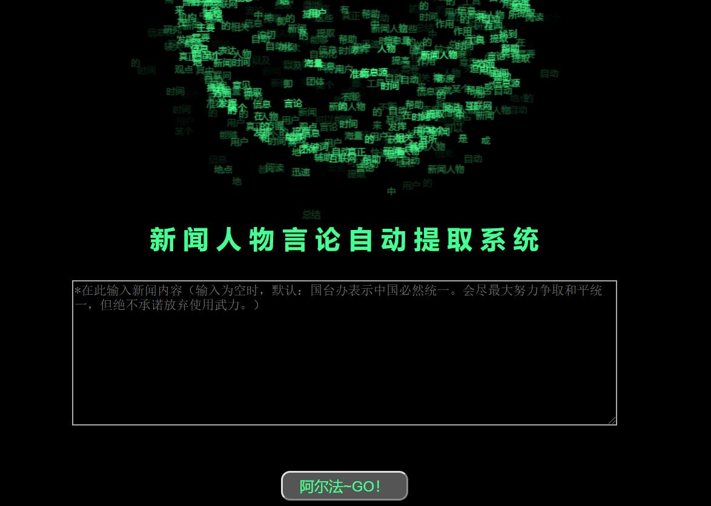

# NewsInfo-Auto-Extration   新闻人物言论自动提取


## 项目展示

http://111.229.74.215:8088/SpeechExtraction/




## 使用指南
### 1. 将项目代码克隆到本地，git clone https://github.com/Valuebai/NewsInfo-Auto-Extration.git

### 2. 安装python环境，本项目使用python3.6.5

### 3. 安装pip包，pip install -r requirements.txt

- linux-CentOS7 安装pyltp可能遇到的坑
  - 执行yum install gcc-c++ 解决报错gcc: error trying to exec 'cc1plus': execvp: No such file or directory
  - 安装pyltp的过程中还是一直报文件的语法错误，pip install pyltp==0.1.9.1  安装成功

### 4. 需要创建的文件夹
- data : 上传相应的数据
```
windows下在cmd输入：tree /f 生成
data（目录下的文件）
│  news-sentences-xut.txt
│  news.txt
│  news_model
│  news_model.trainables.syn1neg.npy
│  news_model.wv.vectors.npy
│  words.txt
│  zhwiki_news.word2vec (下面3个，需要提前训练好wiki的，这块代码见：https://github.com/Valuebai/learn-NLP-luhuibo/tree/master/lesson-04)
│  zhwiki_news.word2vec.trainables.syn1neg.npy
│  zhwiki_news.word2vec.wv.vectors.npy
│
├─ltp_data_v3.4.0
│      cws.model
│      md5.txt
│      ner.model
│      parser.model
│      pisrl.model
│      pos.model
│      version
│
└─stop_words
        stopwords.txt
        哈工大停用词表.txt
```

### 5. 需要修改的config目录，存放数据库、日志配置信息，文件路径（拉取后需要更改路径）
- config目录，修改sys_path绝对路径，看你放在windows还是Linux上的

### 6. 核心代码：./similar_said/speechExtract.py 
- 先对该代码进行测试，用demo进行提取测试，OK 证明代码没问题

### 7. flask的 run.py 部署网站代码
- 运行项目看效果，python run.py 

 
### 8. 项目运行正常，linux上可使用下面的命令让其在后台运行
 ```
 # linux 上需要先安装gunicorn -->> pip3 install gunicorn
 sh run.sh 或者 . run.sh 运行
 ```
开启服务器对应8088端口
firewall-cmd --zone=public --add-port=80/tcp --permanent 永久开启80端口
firewall-cmd --reload #重启firewall 每次新添加端口都要
> 参考：[【Linux】CentOS-常用命令&新购买云服务器安装必看](https://github.com/Valuebai/awesome-python-io/issues/1)
 
### 为Python项目创建独立的虚拟环境（可选）
[python在win/linux创建虚拟环境](https://blog.csdn.net/luhuibo318/article/details/94011917)


### 新购买的linux-CentOS7 云服务器部署指南
1. [【Linux】CentOS-常用命令&新购买云服务器安装必看](https://github.com/Valuebai/awesome-python-io/issues/1)
2. [总结python+flask项目在linux部署的五大方法](https://blog.csdn.net/luhuibo318/article/details/102688154)


## 项目流程：一个简要的思路，供大家参考
Project01：新闻人物言论自动提取得到说话的人和说话的内容
1.	加载语料库
2.	加载模型（ltp分词、词性标注、依存句法分析）（这些在哈工大的ltp语言模型中都有的，只要安装好就可以用）
3.	根据上述模型和语料库（按行处理）得到依存句法关系parserlist
4.	加载预训练好的词向量模型word2vec.model
5.	通过word2vec.most_similar('说', topn=10) 得到一个以跟‘说’意思相近的词和相近的概率组成的元组，10个元组组成的列表
6.	仅仅是上面10个与‘说’意义相近的词是不够的，写个函数来获取更多相近的词。首先把第五步的‘词’取出来，把其后面的概率舍弃。取出来之后，按那10个词组成的列表利用word2vec模型分别找出与这10个词相近的词，这样广度优先搜索，那么他的深度就是10。这样就得到了一组以‘说’这个意思的词语组成的一个列表，绝对是大于10个的，比如说这些近义词可以是这些['眼中', '称', '说', '指出', '坦言', '明说', '写道', '看来', '地说', '所说', '透露',‘普遍认为', '告诉', '眼里', '直言', '强调', '文说', '说道', '武说', '表示', '提到', '正说', '介绍', '相信', '认为', '问', '报道']等。
7.	接下来可以手动加入一些新闻中可能出现的和‘说’意思相近的一些词，但是上面我们并没有找到的，比如‘报道’
8.	获取与‘说’意思相近的词之后，相当于已有谓语动词，接下来要找谓语前面的主语和后面的宾语了。由前面我们获取的句法依存关系，找出依存关系是主谓关系（SBV）的，并且SBV的谓语动词应该是前面获取的‘说’的近义词。那么接着应该找出动词的位置，主语和宾语的位置自然就找出来，就能表示了。那么怎么找位置？刚刚得到的依存关系是这样的[(4, 'SBV'),(4, 'ADV'),(1, 'POB'),(1, 'WP')]形式，前面的序号是取得主词的位置。主谓关系的主词是谓语，而且这个从1开始编号。所以我们就把符合上述要求的（主谓关系，并谓语动词是“说”的近义词）主语和谓语的id找出来。
9.	获得主语和谓语‘说’的序号之后，我们就要取得‘说的内容’也就是SBV的宾语。那么怎么寻找说的内容呢？首先我们看‘说’后面是否有双引号内容，如果有，取到它，是根据双引号的位置来取得。如果没有或者双引号的内容并不在第一个句子，那么‘说’这个词后面的句子就是‘说的内容’。然后检查第二个句子是否也是‘说的内容’，通过句子的相似性来判断，如果相似度大于某个阈值，我们就认为相似，也就认为这第二句话也是‘说的内容’。至此我们得到了宾语的内容。


## 待优化的点
- 模型加载，启动前先加载好所有model
 - ->写个通用的model加载模块
- 算法优化
- extra接口优化


## 前端页面-使用flask jinja2模板

- [flask 中的模板语法 jinja2及render_template的深度用法](https://www.cnblogs.com/baijinshuo/p/10245418.html)

- [Flask学习总结笔记（3）-- Jinja2模板引擎之一](https://blog.csdn.net/kikaylee/article/details/53523598)
- [Flask学习总结笔记（4）-- Jinja2模板引擎之二](https://blog.csdn.net/kikaylee/article/details/53540352)

